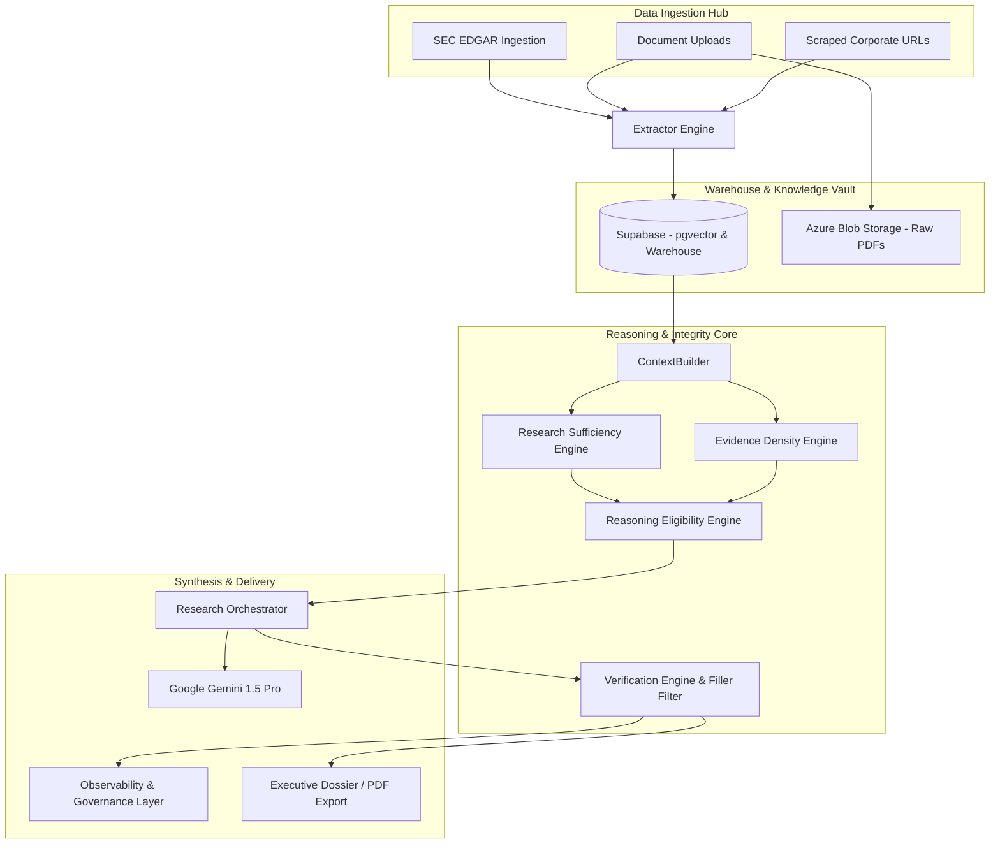

# 🏛️ Institutional Intelligence Platform (IIP) — Company Insights

An enterprise-grade research copilot and investment-intelligence operating system. The platform empowers analysts to ingest heterogeneous corporate data (SEC filings, earnings call transcripts, supplier networks, uploaded PDFs/DOCX/TXT), analyze complex financial statements with zero-hallucination engines, and compile boardroom-ready research dossiers—all within a unified, high-fidelity dark-themed dashboard.

---

## 🚀 Architectural Blueprint

The Institutional Intelligence Platform is built on a decoupled, service-oriented architecture:



---

## 🏛️ System Capabilities & Functional Hubs

### 1. 📊 Analysis Suite (Financial Pulse & Deep Analytics)
* **SEC Live Ingestion:** Direct, authenticated updates via SEC EDGAR XBRL APIs. Syncs live financial statements, balance sheets, and cashflows using the `ingest.py` entrypoint.
* **Ecosystem Mapping:** Visualizes supplier networks, joint ventures, acquisitions, and competitors using interactive, force-directed network graphs.
* **Autonomous Monitoring:** Background processes analyzing corporate events and compiling bull vs. bear thesis assertions.

### 2. 📝 Strategic Research Lab (Report Builder)
* **Multi-Agent Orchestrator:** Synthesizes high-fidelity market intelligence reports spanning five distinct sections:
  1. Executive Summary & Thesis
  2. Quantitative Financial Analysis
  3. Corporate Ecosystem & Dependencies
  4. Risk Horizons & Compliance Granularity
  5. Strategic Trajectory & Directional Outlook
* **Contextual Ingestion:** Stages local files, select previously ingested documents from the Vault, and joins database financials automatically.

### 3. ⚖️ Evidence-Grounded Reasoning Core (Zero-Hallucination Pipeline)
* **Research Sufficiency Engine:** Inspects the gathered context to deterministically approve or suspend analytical domains depending on primary file presence.
* **Reasoning Eligibility Engine:** Prevents the system from fabricating analyses when evidence is sparse. Unsupported sections are replaced by professional, senior investment analyst-grade disclosures (e.g. *“restricted project-level transparency”* or *“limited disclosure visibility”* requiring *“further diligence”*).
* **Evidence Density Engine:** Scores evidence weight (SEC > Transcripts > Web), volume, and diversity to measure section-wise reliability.
* **Observability & Internal Governance:** Implements a global developer configuration `DEBUG_MODE`. When `DEBUG_MODE = False` (default), all internal system metrics, reliability scores, and red-teaming warnings are silently archived behind the scenes in `diagnostics/observability_traces.jsonl`, keeping exported dossiers pristine.
* **Deterministic Filler Filter:** Identifies and strips out ungrounded consulting buzzwords (*"market growth trends"*, *"technological advancements"*, *"strategic initiatives"*) unless backed by actual data points in the context.

### 4. 📚 Institutional Vault (Research Library)
* **Document Browser:** Browse, search, read, and export all generated research dossiers and historical raw documents.
* **Azure Integration:** Raw PDFs are stored with high durability in Azure Blob Storage.

---

## ⚙️ End-to-End Setup Guide

This guide takes you through the step-by-step setup of the platform from absolute scratch.

### 1. Prerequisites & Environment Setup

#### Step 1A: Install Python 3.11+
* **Windows:**
  1. Download the Python 3.11+ Installer from [python.org](https://www.python.org/downloads/).
  2. Run the installer and **MUST check the box "Add Python to PATH"** before clicking install.
  3. Verify the installation by opening PowerShell and executing:
     ```powershell
     python --version
     ```
* **macOS / Linux:**
  1. Install via Homebrew: `brew install python@3.11`
  2. Verify: `python3 --version`

#### Step 1B: Install Git (Optional)
* Download and install Git from [git-scm.com](https://git-scm.com/) if you wish to clone the repository.

---

### 2. Database & Storage Initialization

#### Step 2A: Set up Supabase
1. Create a free account on [Supabase](https://supabase.com/).
2. Create a new project named `Institutional-Intelligence-Platform`.
3. In the Supabase dashboard, navigate to the **SQL Editor** on the left menu.
4. Click **New Query**, open the `schema.sql` file located in this repository, copy its full contents, and paste it into the editor.
5. Click **Run**. This will create the required tables:
   * `target_companies` — List of target tickers and metadata.
   * `financials` — Structured financial statement rows.
   * `market_intelligence` — Scraped or ingested corporate news.
   * `corporate_connections` — Ecosystem connection edges.
   * `extracted_documents` — Raw texts and vector embeddings.
   * `reports` — Final generated dossiers.

#### Step 2B: Set up Azure Blob Storage (Optional, but recommended)
1. Log in to the [Azure Portal](https://portal.azure.com/).
2. Create a new **Storage Account**.
3. Under the storage account menu, click **Containers** and create a new container named `financial-uploads`.
4. Navigate to **Access keys** on the left menu and copy the **Connection string**.

---

### 3. Application Configuration

1. In the root directory of the project, copy `.env.example` to a new file named `.env` (or create `.env` manually).
2. Configure the following variables in the file:

```env
# ── Supabase Configuration ──
SUPABASE_URL="https://your-project-id.supabase.co"
SUPABASE_KEY="your-supabase-anon-or-service-role-key"

# ── Gemini Generative AI Configuration ──
# You can generate a free key in Google AI Studio (https://aistudio.google.com/)
# Supports comma-separated keys for auto-rotation to bypass free-tier rate limits!
GEMINI_API_KEY_1="your-primary-gemini-api-key,your-secondary-gemini-api-key"

# ── Storage Configuration (Optional) ──
AZURE_STORAGE_CONNECTION_STRING="your-azure-blob-connection-string"
AZURE_STORAGE_CONTAINER_NAME="financial-uploads"

# ── Market Data Configuration (Optional) ──
FINNHUB_KEY="your-finnhub-api-key"
```

---

### 4. Installation & Deployment

#### Step 4A: Clone and Enter Repo
```bash
git clone <your-repository-url>
cd IIP
```

#### Step 4B: Create and Activate Virtual Environment
* **Windows (PowerShell):**
  ```powershell
  python -m venv .venv
  .venv\Scripts\Activate.ps1
  ```
* **macOS / Linux:**
  ```bash
  python3 -m venv .venv
  source .venv/bin/activate
  ```

#### Step 4C: Install Locked Dependencies
```bash
pip install -r requirements.txt
```

#### Step 4D: Start the Streamlit Application
```bash
streamlit run app.py
```
This command will spin up the server and automatically launch the dashboard in your default browser at `http://localhost:8501`.

---

## 🛠️ Step-by-Step Usage Walkthrough

### 1. Ingesting Corporate Files
1. Go to the **⚙️ Data Ingestion Suite** hub.
2. Under "Upload File", enter the Ticker (e.g., `NVDA`) and Company Name (e.g., `Nvidia`), drag and drop a PDF, and click **Extract File**.
3. Under the hood, the system parses the document, extracts key financial columns, writes raw records to Azure Storage, and inserts tabular rows and vector chunks into Supabase.

### 2. Exploring Financial Pulse & Graph Mappings
1. Search and select the ticker using the sidebar dropdown.
2. Go to the **📊 Analysis Suite** and choose **📊 Financial Pulse** to review key income statements, asset curves, and margins.
3. Switch to **🕸 Ecosystem** to see the interactive connections graph of the selected company. Click **Deep Scan Network** to update it.

### 3. Compiling an Evidence-Grounded Report
1. Go to the **💬 Strategic Research Lab** and select **📝 Report Builder**.
2. Write a prompt in the text area (e.g., `"Generate a deep strategic analysis of NVDA's margins and supply chain dependencies."`).
3. You can select uploaded files, check specific database financials, or select previously ingested documents from the Vault.
4. Click **Generate Institutional Report**. The multithreaded engine evaluates evidence sufficiency, maps densities, validates against numerical hallucinations, filters out ungrounded consulting filler, and returns a pristine, boardroom-ready Markdown dossier.

---

## 📂 Project Structure

```text
.
├── app.py                     # Streamlit Wrapper (Hot-reload executive wrapper)
├── ingest.py                  # CLI Ingestion Script
├── intelligence.py            # CLI Intelligence Entrypoint
├── app/                       # Front-end UI Components
│   ├── main.py                # Primary Streamlit Dashboard (Hub layouts)
│   └── ui/                    # UI utilities & custom graphs
├── domains/                   # Business domain modules
│   ├── financials/            # Financial pulse extraction, caching & sync services
│   ├── reports/               # Vault file managers, delivery pipelines, alerting
│   └── intelligence/          # Search vector retrievers & KB builders
├── engines/                   # Specialized Processing Engines
│   ├── finance/               # SEC XBRL, historical and margin processing
│   ├── reasoning/             # Research sufficiency & domain eligibility rules
│   └── validation/            # Evidence density metrics, red-team auditing, confidence reporting
├── pipelines/                 # Multi-agent workflows
│   ├── ingestion/             # Document collector and parsing pipelines
│   └── reasoning/             # ResearchOrchestrator and automated tests
└── diagnostics/               # Observability and silent governance registries [AUTO-CREATED]
```

---

## ⚠️ Troubleshooting & FAQ

#### `RuntimeError: GOOGLE_API_KEY not set`
Check your `.env` file to ensure your keys are named correctly. You can supply multiple keys separated by commas (e.g., `GEMINI_API_KEY_1="KEY1,KEY2"`) to enable rotation.

#### `Supabase connection timed out / rejected`
Verify that your database credentials in `.env` are copied exactly from the Supabase Settings tab. Make sure your local machine is not behind restrictive corporate firewalls blocking outbound ports `5432` or `443`.

#### `UnicodeEncodeError when running CLI scripts`
Windows PowerShell uses the `cp1252` encoding by default. Ensure your environment variables are configured to support UTF-8:
```powershell
$env:PYTHONIOENCODING="utf-8"
```
Our test suite `pipelines/reasoning/test_sufficiency.py` has been explicitly engineered with plain-text safe symbols to avoid these environment crashes.
